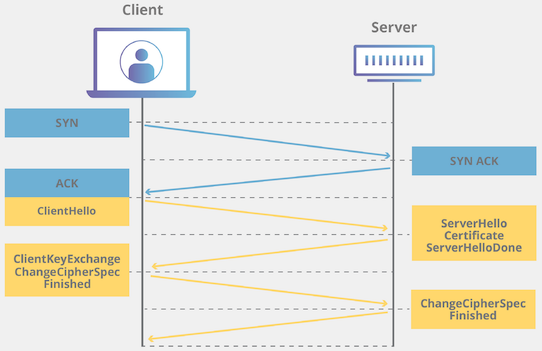
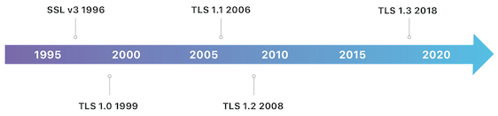

# Go for cybersecurity - learning

([Source](https://github.com/jreisinger/docs/blob/master/blog/gosec/2023-09-26-go-for-cybersecurity-learning.md) of this post.)

I think cybersecurity practitioners should be able to program. If they do, they can understand computer technologies better and they can automate tasks by building tools. And this is something I want to demonstrate a bit in this post and the [next one](https://jreisinger.blogspot.com/2023/09/go-for-cybersecurity-tools.html).

## But why Go

I think no one really doubts it's a good thing to be able to program. But why Go and not some other language, like Python? I think you should also learn Python and Bash and Javascript, if you can. Following are some qualities of Go I like.

Simplicity. Einstein said "Everything should be made as simple as possible, but not simpler". That sounds right and Go is trying to follow this idea. You want simplicity because there's already enough technological (and organizational) chaos. You want simplicity because it's easier to understand and thus tends to have fewer bugs and it's easier to modify or extend.

Security. Go is a relatively new language (version 1.0 was release in 2012) built with safety and security in mind. This is not true of languages created in the pre-Internet era (Python appeared in 1991 and C in 1972) that was more innocent. 

Backward compatibility. Go maintainers [claim](https://go.dev/doc/go1compat) that "it is intended that programs written to the Go 1 specification will continue to compile and run correctly, unchanged, over the lifetime of that specification. ... The APIs [the standard packages] may grow, acquiring new packages and features, but not in a way that breaks existing Go 1 code." It basically means that you don't need to worry that the programs you write will stop working and you will need to investigate what to do to bring them back to life.

Future proof. I think Go has a future so it makes sense to invest into learning (or even mastering) it. Go was developed and it's maintained by very experienced and skilled people, like Rob Pike (of Plan 9 and UTF-8 fame), [Ken](https://github.com/ken) Thompson (Unix, B, grep), Russ Cox. Although it's an open source language, it's supported by Google that's not likely to run out of money in the foreseeable future. A lot of important software is already written in Go, like Kubernetes or Terraform. It has a first class support on all cloud providers and most of the Cloud Native Computing Foundation (CNCF) projects are written in Go.

Typed, compiled, C-like language. If you are (as I was) familiar only with dynamic scripting languages like Python or Perl, Go will help you to really understand what are the large-scale systems languages like.

Cross-compilation to a single binary. You can build your program to run on any supported computer (CPU) architecture and operating system. For example, if your are using a Mac and want to run your tool on a Linux based Raspberry Pi:

```
$ GOOS=linux GOARCH=arm64 go build mytool.go
$ scp ./mytool user@raspberry.net:
$ ssh user@raspberry.net ./mytool
```

To list all supported platforms:

```
$ go tool dist list
```

## TLS version

You (or your boss :-) read [somewhere](https://www.cloudflare.com/en-gb/learning/ssl/why-use-tls-1.3/) that TLS 1.2 is not secure and fast enough. Everyone should be using TLS 1.3! Are we?

Let's have look. As usual we need two generic steps to solve this puzzle. First of all we need to know what TLS is. Second of all we check what versions are we using for our services.

## What is TLS - learning by reading

TLS (Transport Layer Security), formerly known as SSL, is a protocol to encrypt, authenticate and check the integrity of data that is transferred over network. You can think of it as secure TCP. The nowadays omnipresent HTTPS is an extension of HTTP that uses TLS underneath. As you can see in the picture below in yellow, a TLS connection is initiated via TLS handshake (the blue stuff is the standard three-way TCP handshake).



One of the things negotiated during the handshake between the client and the server is the version of TLS to use. As usual, there are several TLS versions. TLS 1.3 is the latest version, that also happens to be the fastest and most secure. You should be using TLS 1.3.



## What is TLS - learning by doing

There's a difference between knowing the path and walking the path. Or, as [Evi](https://admin.com/) Nemeth said: "You don't really understand something until you've implemented it".

### TCP

Let's start with TCP because we said that TLS is kind of a secure version of TCP. All we need to implement a TCP server and client is inside the [net](https://pkg.go.dev/net) standard library package.

The **server** code has three parts: listening, accepting and handling.

First we need to start listening for incoming TCP connections on some address (host + port):

```go
ln, err := net.Listen("tcp", "localhost:8000")
if err != nil {
	log.Fatal(err)
}
defer ln.Close() // execute when surrounding function (main) returns
```

Then we enter an infinite loop in which we accept and handle incoming connections:

```go
for {
	conn, err := ln.Accept()
	if err != nil {
		log.Print(err)
		continue
	}

	go handle(conn) // handle connections concurrently
}
```

The handle function is running in a goroutine which means the program doesn't block waiting for the function to return. In continues running the loop handling multiple connection concurrently.

The connection handling is really simple, we just copy back whatever we receive:

```go
func handle(conn net.Conn) {
	defer conn.Close()
	io.Copy(conn, conn)
}
```

The **client** code has also three parts: connecting, writing and reading.

First we need to connect to an address of a TCP server:

```go
conn, err := net.Dial("tcp", "localhost:8000")
if err != nil {
	log.Fatal(err)
}
defer conn.Close()
```

Next we send out some bytes (converted from a string):

```go
_, err = io.WriteString(conn, "Hello from client.")
if err != nil {
	log.Fatalf("client write error: %s", err)
}
```

And then we receive some bytes (printed as a string):

```go
buf := make([]byte, 256)
n, err := conn.Read(buf)
if err != nil && err != io.EOF {
	log.Fatal(err)
}
fmt.Printf("client read: %s\n", buf[:n])
```

Now let's run the server and client:

```sh
$ go run tcp/server/echo.go

# from another terminal tab/window
$ go run tcp/client/main.go
client read: Hello from client.
```

You can find the whole code at https://github.com/jreisinger/docs/tree/master/blog/gosec/tcp.

### TLS

As we've learned, TLS adds encryption, authentication and integrity checking to TCP connections. Let's see.

The **server** code will be very similar to TCP server only we'll use the [tls](https://pkg.go.dev/crypto/tls) package instead of the `net` package:

```go
ln, err := tls.Listen("tcp", "localhost:4430", config)
if err != nil {
	log.Fatal(err)
}
defer ln.Close()
```

Ok, we need some configuration for TLS to work. What's that? TLS works by using public key cryptography. The TLS server needs a private key to encrypt and sign data and a certificate to authenticate to the client:

```go
certFile := flag.String("cert", "cert.pem", "certificate file")
keyFile := flag.String("key", "key.pem", "private key file")
flag.Parse()

cert, err := tls.LoadX509KeyPair(*certFile, *keyFile)
if err != nil {
	log.Fatal(err)
}
config := &tls.Config{Certificates: []tls.Certificate{cert}}
```

Let's run the server:

```sh
$ go run tls/server/echo.go
2023/09/26 21:02:33 open cert.pem: no such file or directory
exit status 1
```

Right. We don't have the certificate or the private key. Let's create them using [mkcert](https://github.com/FiloSottile/mkcert) and re-run the server:

```sh
$ mkcert localhost
<... snip ...>
$ go run tls/server/echo.go -cert localhost.pem -key localhost-key.pem
```

X509 certificates contain server's public key, along with its identity and a signature by a trusted authority (typically a Certificate Authority). You can have a look:

```sh
$ openssl x509 -in localhost.pem -text -noout
```

The TLS **client** differs from the TCP client in a that it needs a trusted CA certificate that can be used to verify the server:

```go
certFile := flag.String("cert", "cert.pem", "trusted CA certificate")
flag.Parse()

data, err := os.ReadFile(*certFile)
if err != nil {
	log.Fatal(err)
}
certPool := x509.NewCertPool()
if ok := certPool.AppendCertsFromPEM(data); !ok {
	log.Fatalf("unable to parse certificate from %s", *certFile)
}

config := &tls.Config{RootCAs: certPool}
conn, err := tls.Dial("tcp", "localhost:4430", config)
if err != nil {
	log.Fatal(err)
}
defer conn.Close()
```

```sh
$ go run tls/client/main.go -cert localhost.pem
client read: hello from client
```

You can find the whole code at https://github.com/jreisinger/docs/tree/master/blog/gosec/tls.
